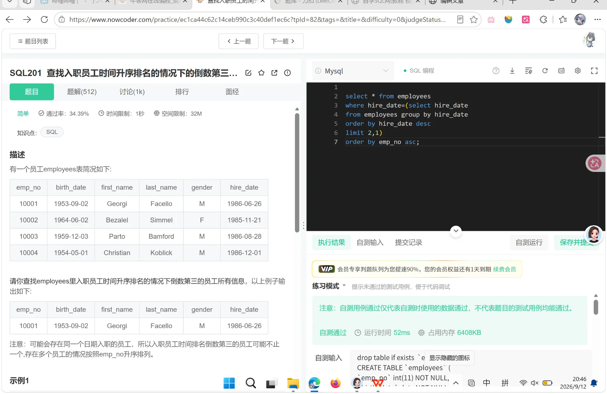

#### 查找 employees 里入职员工时间升序排名的情况下倒数第三的员工所有信息
###### 注意：可能会存在同一个日期入职的员工，所以入职员工时间排名倒数第三的员工可能不止一个，存在多个员工的情况按照 emp_no 升序排列。这是原题。

> select * from employees
where hire_date=(select hire_date 
 from employees group by hire_date 
order by hire_date desc
limit 2,1) 
 order by emp_no asc;
 
 里面嵌套的：
select hire_date 
from employees group by hire_date 
order by hire_date desc
limit 3
输出的应该是日期去重后由大到小第三个日期。
外层语句打印出有该日期入职的所有员工，同时按照工号由大到小。
https://www.nowcoder.com/practice/ec1ca44c62c14ceb990c3c40def1ec6c?tpId=82&tags=&title=&difficulty=0&judgeStatus=0&rp=1&sourceUrl=%2Fexam%2Foj%3Ftab%3DSQL%25E7%25AF%2587%26topicId%3D82
没错，可以的哈哈哈哈哈哈，最开始只不过有小错误，思路完全正确。
修改一下就欧克了！！！哈哈哈
没想到真的这么好玩，解决一个难题。
可惜没有早早坐进图书馆学习，没事，无限进步！！！

（服了，等我有时间把这输入文本这块修一下，太难弄了。没法上下滑动）

2026.9.12 周六20：51 下午吃的刘鑫三楼螺狮粉小火锅。