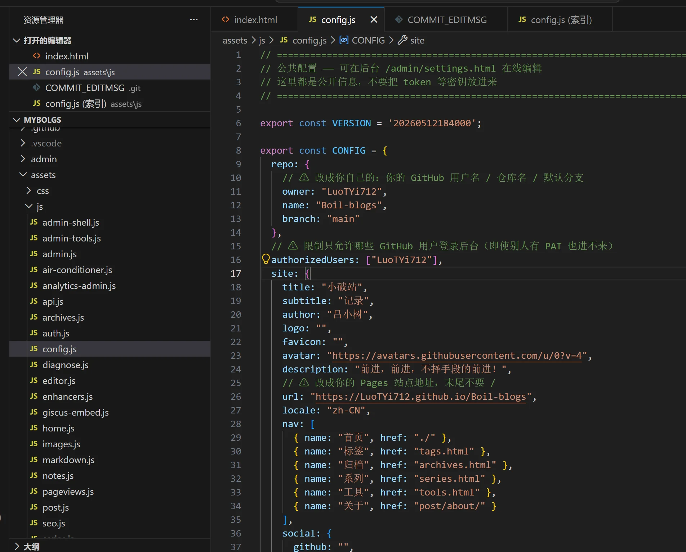

弄了一下午，从上课两点多开始一直到现在20点04，一路磕磕绊绊，先是用命令拉取拉不下来。

于是手动下载压缩包。放进vscode，上传半天传不上去，因为用的国内代理。代理是全局代理自动覆盖，豆包一遍一遍的查，改掉了项目下面的.git里面的上传网站。愣是不知道看全局设置，搞这个搞半天。

终于上传上去后，以为万事大吉，结果网页一打开，点击里面的栏目跳转直接失败，又是问豆包，搞半天，气死人！

于是乎我打开豆包工作任务，选择本地电脑让它查看文件，发现说要修改里面的URL为自己的GitHub仓库路径。

（这个写东西的页面有问题，没有滑轨，不能通过滑动上下翻页，把这个框子覆盖完后上面的文字段落以及文件上传等功能就点不到了！）

于是让豆包给我修改后我再上传，终于差不多了，当时都已经六点多要饿死了。早上11：20吃的饺子，不到一斤10.21rmb。

接着看着里面的的“你的新博客 · 从这里开始”操作，再次修改了一下assets/js/config.js 把网页标题、介绍等信息。本想着直接点击VScode里面的提交按钮，没想到狗日的一直转圈圈，转个不停还一点都提价不上去。气死人。于是又让豆包给我命令，一下就传上去了。

今天还没开始看课呢，学到mysql了，加油！！！

（昨晚又弄switch升级大气层系统22.5.0 《节奏天国-奇迹之星》终于装上了，算上上次系统崩坏，这是第三次搞机了 越来越简单了）

   2026年9月4日 晴 周五 20点38分
